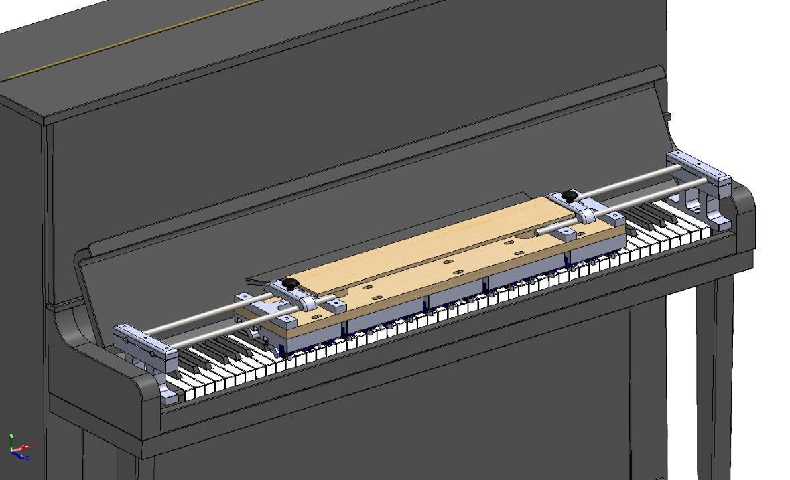
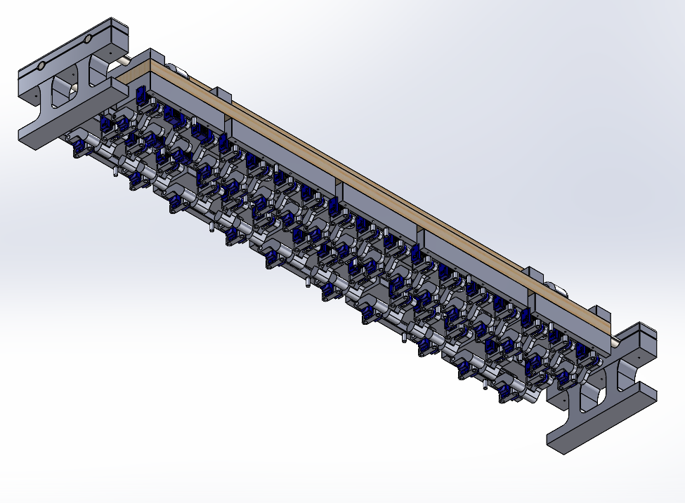
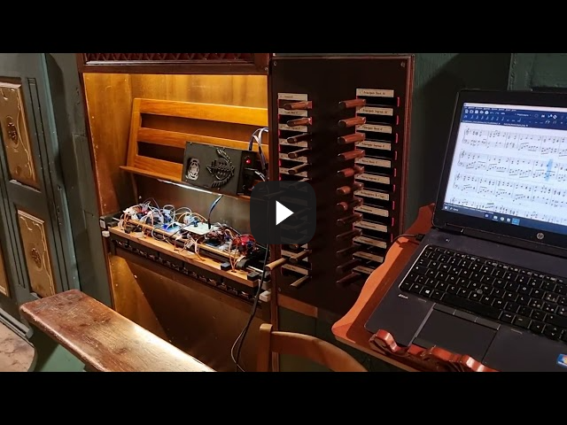

# Bach-o-mat: Electromechanical MIDI Player for Keyboards

|  |  |
| --------------------- | --------------------------- |

**Bach-o-mat** is an open-source electromechanical device designed to play **pipe organs**, but it can also be used on any **keyboard instrument**. It operates using **Arduino and micro servomotors**, allowing it to play music by interfacing with a **MIDI control device**.

---

## How It Works
A control device (such as a **PC or smartphone**) connects to Bach-o-mat via **USB** (with **Bluetooth support coming soon**) and sends MIDI signals to activate the keyboard's notes.

## Modular and Expandable Design

Originally developed for **58-note keyboards**, a standard commonly used in **pipe organs until the late 19th century**, Bach-o-mat is built on a **modular architecture**:

- Each **octave of natural keys** and **accidental keys** is handled by separate mechanical modules.
- Modules can be easily **combined** and **repositioned** to fit keyboards of different sizes and also with **different key widths**.
- **Sliding side supports** can be employed in order to freely match the layout of any keyboard instrument.

---

## Repository Structure

The repository is organized to support **multiple hardware and electronics versions**.

```
Bach-o-mat/
├── hardware_versions/ # Different 3D and 2D mechanical designs
│ ├── standard/
│ ├── optimized/
│ └── ...
├── electronics_versions/ # Different circuit designs and firmware
│ ├── v1/
│ ├── v2/
│ └── ...
├── docs/ # Shared instructions and documentation
├── README.md # This file
└── LICENSE # Open-source license
```


### `hardware_versions/`

This directory contains **alternative mechanical versions** of Bach-o-mat:

- `standard/`: Original version for 58-note keyboards, with sliding side supports and a horizontal depth of .... cm
- `optimized/`: 56-notes keyboard version, with fixed supports and an optimized horizontal depth of .... cm

Each subfolder includes:
- **3D models** for 3D printing
- **2D design files** for laser cutting and CNC machining
- Assembly diagrams and media
- A local `README.md` describing that version

### `electronics_versions/`

This directory contains **electronics and firmware variants**, each matching a different design approach:

- `v1/`: Only USB-MIDI interface, with 1 Arduino Micro as master and 5 Arduino Nano as servo controllers
- `v2/`: USB-MIDI and BLE-MIDI interface, with 1 Arduino Nano 33 IoT as master, 1 Arduino Micro for USB-MIDI interface and 5 PCA9685 modules as servo controllers

Each subfolder includes:
- Circuit schematics and wiring diagrams
- Arduino code and configuration files
- Python code of the calibration program
- A local `README.md` with build and upload instructions

---

## Getting Started

1. Browse available versions in [`hardware_versions/`](hardware_versions/) and [`electronics_versions/`](electronics_versions/)
2. Select the combination that fits your needs
3. Follow the `README.md` inside the chosen folders for detailed instructions
4. Assemble, upload firmware, and connect your MIDI control source
5. Enjoy automated keyboard music!

---

## Demonstration

A video demonstration of Bach-o-mat in action is available:

[](https://youtu.be/sfZ5kHSBi4M?si=CWz8P8_79pBXwW5q)

---

## Future Improvements

- **Expanded keyboard support** for even larger instruments
- **Optimized motor response** for improved playability

---

## License

Bach-o-mat is released under the **GNU General Public License**, making it freely available for modification and use. If you improve the project, consider contributing your modifications back to the community.

---

For any inquiries or contributions, please open an **Issue** or submit a **Pull Request**.
