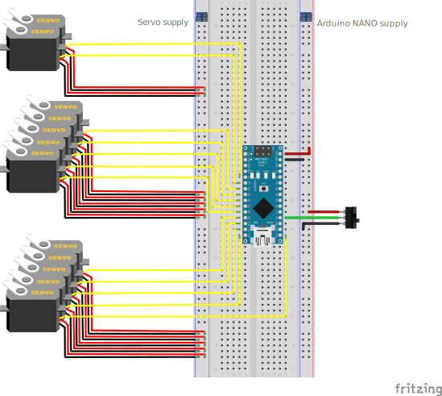
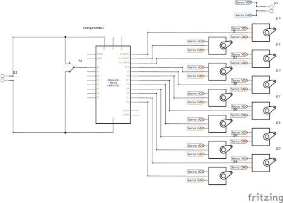

# Electronics - Version 1 - MIDI-USB device

This is the first developed version of Bach-o-mat's electronics and firmware, which allows a USB-MIDI connection to the automaton and performs the calibration procedure through a PC.

In terms of microcontrolers here we use

- **Master**: 1x Arduino Micro, which receives MIDI events over USB and routes them to the Nano boards.  
- **Slaves**: 5× Arduino Nano, each controlling 12 servos (one octave of notes).

---

## Table of Contents

1. [Hardware Requirements](#hardware-requirements)  
2. [Schematic & Wiring](#schematic--wiring)  
3. [Software Requirements](#software-requirements)  
4. [Usage](#usage)  
5. [Calibration Mode](#calibration-mode)  
6. [Folder Contents](#folder-contents)
7. [License](#license)  

---

## Hardware Requirements

- 1× **Arduino Micro**  
- 5× **Arduino Nano**  
- 60× servos (12 per Nano)  
- Common I²C bus (SDA/SCL) wiring  
- 5 V power supply capable of driving all servos  
- Push-button or switch to Arduino Micro pin 8 (calibration/play mode)  
- Wires, resistors, prototyping board or custom PCB  

---

## Schematic & Wiring

1. **Arduino Micro**  
   - Pin 8 → calibration mode switch  
   - Built‐in LED → mode indicator
   - USB → PC MIDI‐USB
   - SDA, SCL → shared I²C bus to all Nanos

2. **Each Arduino Nano**  
   - A0 (analog) → calibration mode detect  
   - Digital pins 2…13 → servo signal lines (one per note, in total 12 servos (one octave of notes) per Nano)  
   - SDA, SCL → shared I²C bus  
   - 5 V and GND → common power rails  

> **Note:** Assign each Nano a distinct I²C address equal to `OFFSET_INDIRIZZI + INDIRIZZO_MANO`, where `INDIRIZZO_MANO` = 0…4.

 

---

## Software Requirements

- Libraries:
  - `MIDIUSB.h`  
  - `Wire.h`  
  - `Servo.h`  
  - `EEPROM.h`  

---

# Usage

## Play mode
- Ensure the calibration switch is LOW (play mode); the Micro’s LED will be OFF.
- Connect the Arduino Micro to your PC via USB and the entire system to a 5V voltage source.
- In your MIDI software, select "Arduino Micro" as MIDI output.
- Play notes: the Micro reads MIDI Note On/Off, maps them to servos, and sends I²C commands to the Nanos.

## Calibration Mode
The system enters in the calibrtion mode when, <u>at its startup</u>, the calibration switch is HIGH
Arduino Micro listens on Serial @9600 bps and forwards setup commands over I²C.
Arduino Nano enters setup to map servo angles and save them to EEPROM.

**Workflow**:
	Send 3–4 byte packets over Serial to the Micro:
	- operation byte (1=push/release, 2=set angles, 3=set+save)
	- servo_num (0…11)
	- data_1 (off‐angle)
	- [data_2] (delta_angle, only for op≠1)

This operations can be done easily by using the [calibration_GUI_v1.py] (/calibration_GUI_v1.py) provided.

Exit calibration mode by switching to LOW the calibration switch: Nanos will load saved angles and begin normal play.

## Folder Contents

```
v1/
├── master_v1/
│   └── master_v1.ino
├── slave_v1/
│   └── slave_v1.ino
├── schematics/
│   ├── slave_bb.svg
│   └── slave_schem.svg
├── calibration_GUI_v1.py
└── README.md # This file
```

## License

Bach-o-mat is released under the **GNU General Public License**, making it freely available for modification and use. If you improve the project, consider contributing your modifications back to the community.

---

For full documentation and software, return to the [main README](../../README.md).

For any inquiries or contributions, please open an **Issue** or submit a **Pull Request**.
