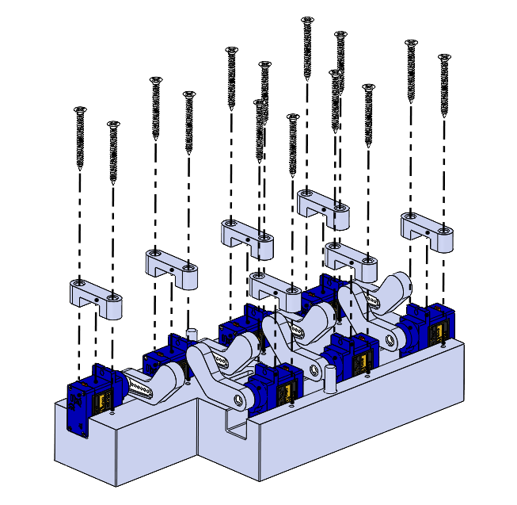
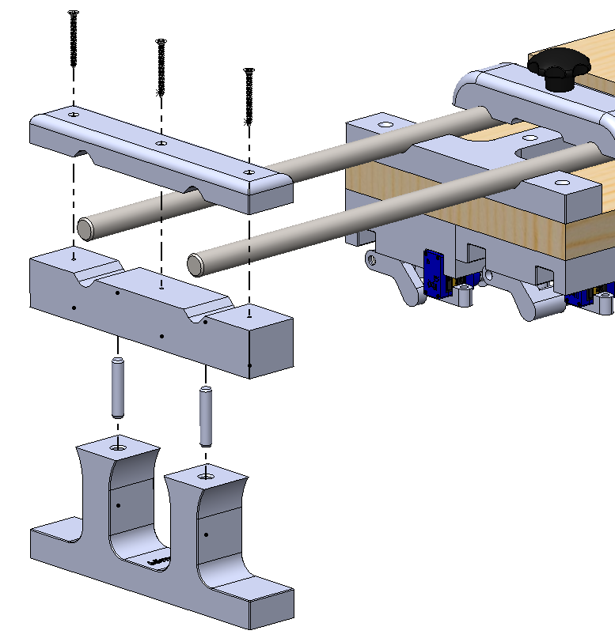
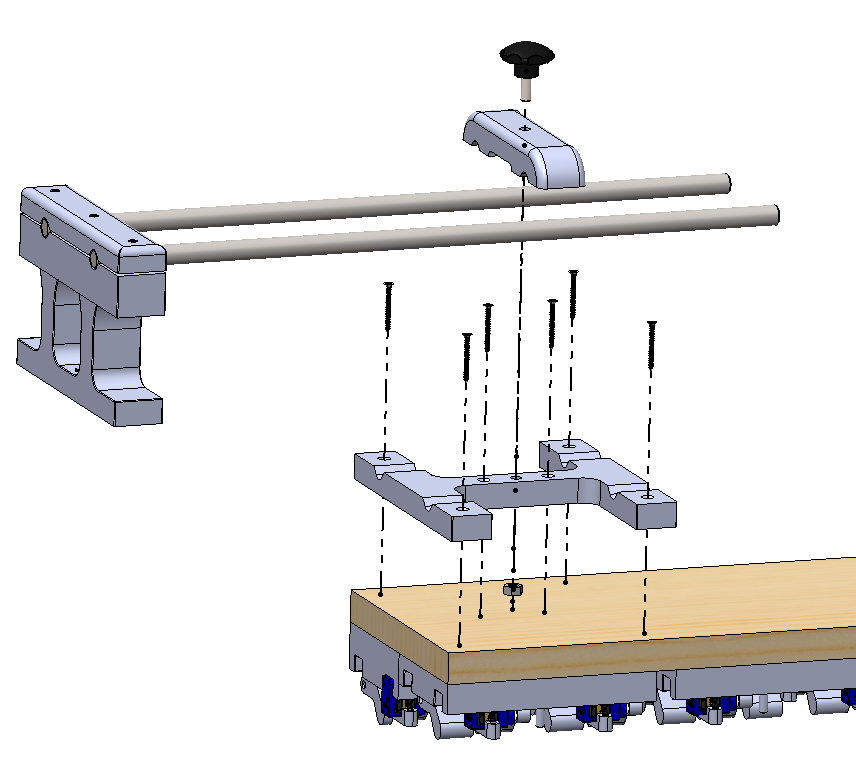
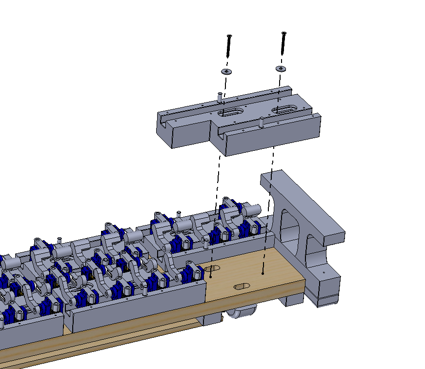

# Hardware - Version Standard - 58-Key Modular Design

This is the **original mechanical version** of the Bach-o-mat, designed for **58-key pipe organ-style keyboards**.

 

---

## Table of Contents

1. [Key Features](#key-features)  
2. [Assembly Overview](#assembly-overview)
3. [Compatibility](#compatibility)  
4. [Folder Contents](#folder-contents)
5. [Reference Images](#reference-images)  
6. [License](#license)

---

## Key Features

- Supports **58 keys**
- **Modular structure**: Separate modules for each octave of natural and accidental keys
- **Adjustable horizontal spacing** for compatibility with various key widths from ... mm to ... mm
- **Sliding support bars** for flexible placement across different instruments
- Designed for **FDM 3D printing** and **laser cutting**

---

## Assembly Overview

Each octave consists of:
- A **natural keys module** (white keys)
- An **accidental keys module** (black keys)

For both natural keys and accidental keys modules there is a shorter model for the last octave which has only 10 notes.

These modules can be **replicated and aligned** to form the full 58-key span.

The device rests on two **side support bars**, which:
- Slide to match the keyboard width
- Allow for **non-invasive mounting** (no screws or adhesives required)

The servos are housed in a base layer and press the keys from above using improved 3D printed mechanical arms.

Here below you can find some exploded views for a better understanding of the assembly process.

| Description | Picture |
|-------------|---------|
|Motors on the support  |<p align="center"></p>|
|Rod end                |<p align="center"></p>|
|Rod guide              |<p align="center"></p>|
|Support on board       |<p align="center"></p>|

---

## Compatibility

Thanks to the adaptibility of its supports this version is intended for being carried in different places and used to play a wide range of disparate keyboard instruments.<br>
The 3D printable modules are designed to be compatible with almost any keyboard, both historical and commercial, leaving just the duty to pay attention to where to screw them. They should also fit well with quite any commercial microservo available nowadays.<br>
The only non-standard components are the arms of the servos, which may change quite a lot among different models and brands. The 3D printable files provided have therefore a proper external shape, but it might be necessary to change the socket for the servo arm.

---

## Folder Contents

```
standard/
├── 3D_models/ # STEP files for all printed parts
├── 2D_designs/ # DXF files for laser-cut components
├── assembly_media/ # Images and diagrams
├── exploded_views/ # Assembly 3D schemes
└── README.md # This file
```

---

## Reference Images

| Description | Picture |
|-------------|---------|
| Assembled Device on Piano  | <p align="center"></p> |
| Assembled Device on Organ  | <p align="center"></p> |
| Full Module View           | <p align="center"></p> |

---

## License

Bach-o-mat is released under the **GNU General Public License**, making it freely available for modification and use. If you improve the project, consider contributing your modifications back to the community.

---

For full documentation and software, return to the [main README](../../README.md).

For any inquiries or contributions, please open an **Issue** or submit a **Pull Request**.
